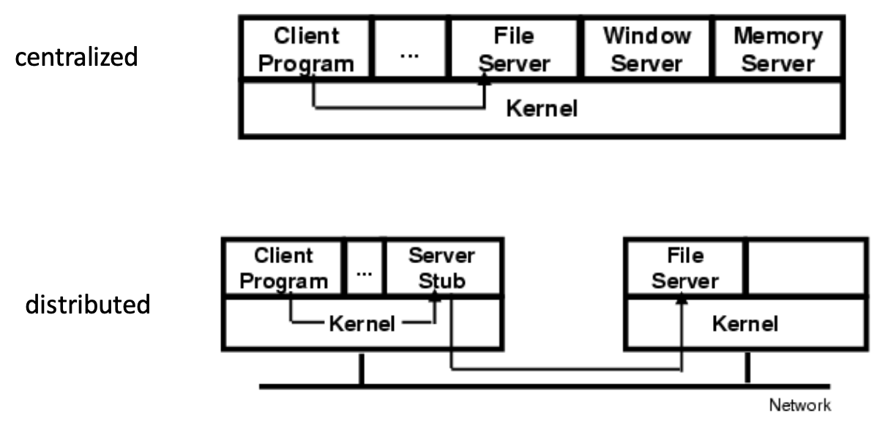
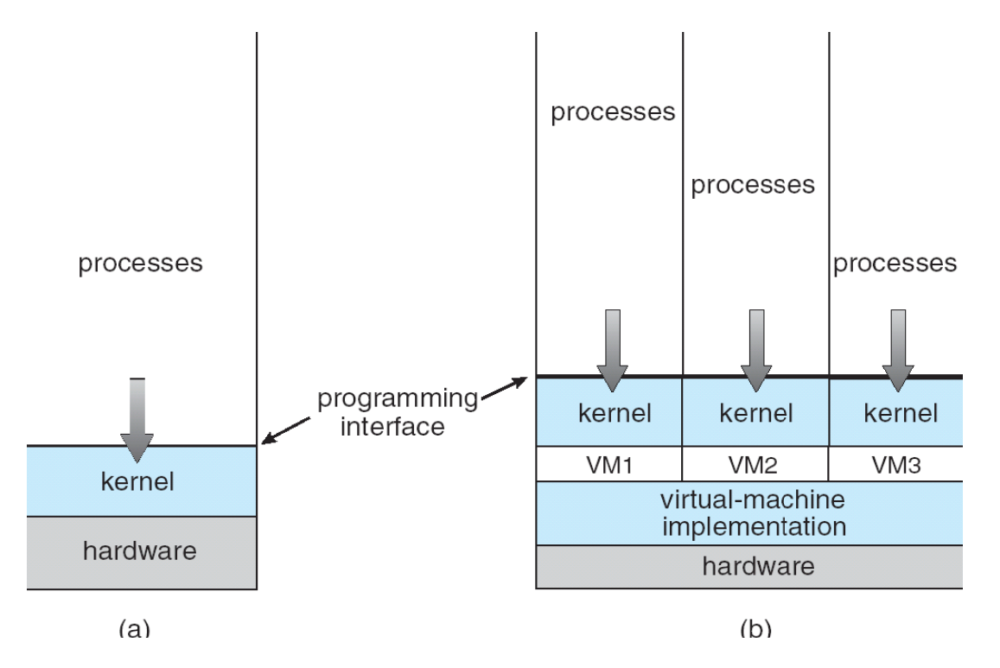
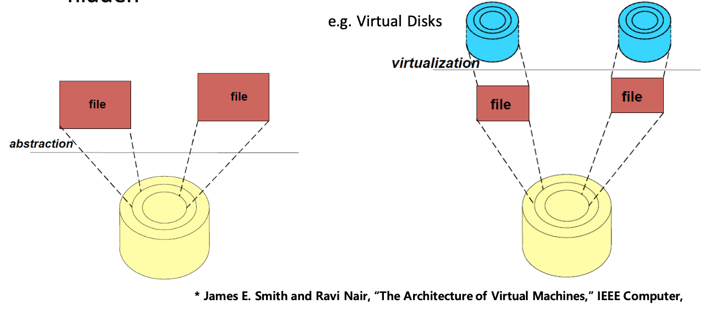
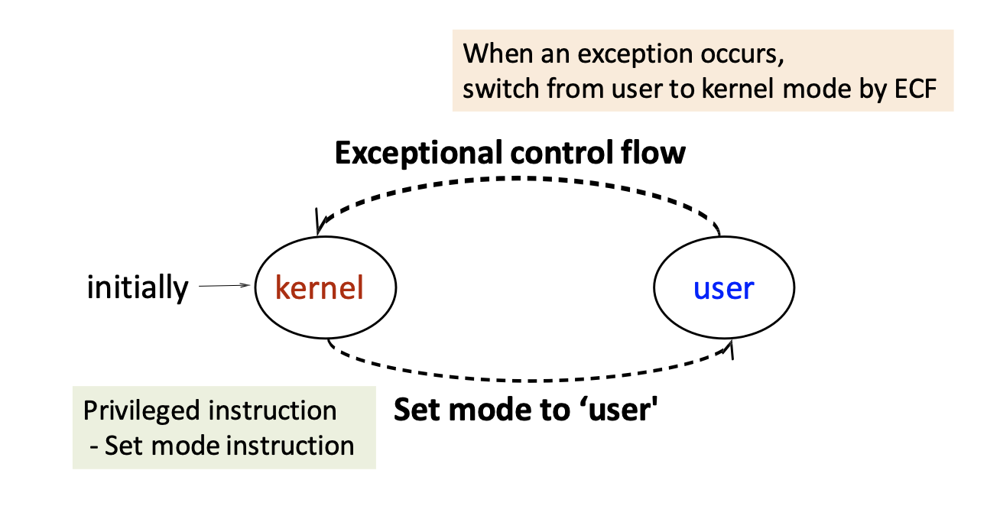
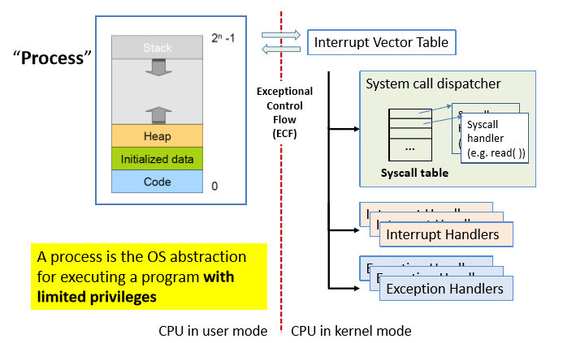

## 운영체제의 역할

OS는 프로그램을 실행하고, 프로그램 간에 메모리를 공유하고, 디바이스와 상호작용을 하는 책임이 있다. 이 때 운영체제는 이러한 작업을 정확하고 효율적으로 처리하기 위해 존재한다. 다양한 물리 디바이스를 가상 형태로 변환해서 다룬다. 또한, 운영체제는 CPU, memory, disk 등의 리소스 매니저 역할을 한다. 여러 프로그램들을 수행하고 싶을때, cpu를 공유하고, 동시에 여러 프로그램의 메모리에 엑세스하고 싶은때 메모리 공유등의 작업을 수행한다. 프로그램이 파일을 만들고 싶을때, 프로그램이 OS에 파일을 만들도록 요청하고, OS가 물리 디바이스에 실제 파일을 생성하게 된다. 운영체제의 대부분의 기능들은 이러한 작업들의 스케쥴링, 효울화, 등을 수행한다. 

하지만, 물리적인 디바이스들을 직접 다루는 것은 어렵기 때문에, 추상화 계층을 추가해 하드웨어를 감싼다. CPU는 프로세스와 스레드, 메모리는 address space, 디스크는 파일의 형태로 관리는 한다. 이렇듯이 OS는 서비스 제공자와 리소스 관리자의 역할을 수행한다. 

## 운영체제을 만드는 방법?

운영체제 구조에는 여러가지 패러다임이 있다. 
모노리틱 커널 (Monolithic kernel) 은 일반적인 모노리틱 구조의 장단점을 그대로 가지고 있다. 
```diff
+ 컴포넌트간 빠른 인터랙션
+ 쉬운 공유
- 이해하기 어렵다
- 수정하기 어렵다
- 버그 발생시 신뢰성이 떨어지고 유지보수 성이 떨어진다
```
레이어드 구조는 하나의 레이어는 아래 레이어의 추상화라고 볼 수 있는 구조다. 
```diff
+ 작은 태스크에 집중하기 좋다
+ 대형 시스템을 순서대로 개발하기 좋다
- 단순 레이어링으로는 실제 시스템을 구현하기 어렵다
- 레이어 크로싱을 할때의 성능 저하가 심하다 (Window NT)
```
마이크로 커널 구조는 커널로 진입하는 일을 줄이고 OS의 여러 기능을 유저 레벨 프로세스로 구현한다. 
```diff
+ 작은 부분으로 나눠 설계하기 때문에 신뢰성이 높다
+ 확장성과 수정이 쉽다
- 컴포넌트 간의 상호작용을 할때 성능 저하가 심하다 (OS 컴포넌트 간의 상호작용이 더이상 프로지져 콜이 아니고 inter-process 상호작용이기 때문이다)
```



### 가상환경 (Virtualization)
가상환경은 하위 레이어에 대한 오퍼레이션을 현재 레이어에도 가능하게 하는 것이다. 예를 들자면, OS는 디스크를 파일로 추상화 해서 사용한다. OS가 파일을 생성하는 것과 같은 행위를 파일을 디스크 처럼 취급해 가상화를 하는 것이다. 


## OS 커널의 부트스트랩핑
우리가 컴퓨터를 킬 때 OS는 다음과 같은 순서로 구동해. ROM의 사전 정의된 주소에 위치해 있는 바이오스로 점프를 하게되고. 이 바이오스는 OS 커널을 메모리에 로드를 하고 그곳으로 점프를 하게 되. 이렇게 OS 구동 인스트럭션으로 진입하게 되면, OS는 로그인 앱의 인스트럭션과 데이터를 실행해. 이런 로그인 앱은 일종의 executable 인데, 컴퓨터가 수행할 수 있는 명령어들의 집합을 실행파일이라고 부를수 있어. CPU는 현재 Programe Counter 에 따른 명령어를 집어서 수행을 해. 자세한 내용은 아키텍쳐 과목에서 배웠을 테니 생략하도록 할게. 


## CPU Control Flow
CPU를 컨트롤하면서 PC를 이동하게 되는 케이스는 다음과 같아. 첫째로는 점프와 브랜치, 두번째는 스택을 이용해서 call 하거나 return 하는 것이야. 물론 call 과 리턴도 일종의 점프라 볼 수 있겠지만, 이 두 케이스는 프로그램의 상태에 따른 "정상 실행" 과정 중 하나로 볼 수 있어. 다만, 컴퓨터를 사용하면서 다양한 예외 케이스들이 발생을 하게 되는데, 이럴때를 위한 컨트롤 플로우도 필요해. 이런한 예외 케이스의 예시는
- 디스크나 네트워크로부터 데이터가 도착, 타이머 만료, ctrl-c 같은 시그널
- zero division 
등이 존재해. 이러한 프로그램의 상태가 아닌 시스템의 상태로 인한 컨트롤 플로우는 exception을 발생 시켜 핸들을 해. 이 플로우는 우리는 Exceptional Control Flow (ECF) 라고 불러. 이 ECF에서는 
어떤 이벤트가 예외를 발생시켰는지 (exception number), 어떻게 예외를 처리할지 (exception handler), 그리고 어떻게 exception handler 로 점프하고, 원래 플로수로 복귀할지 에 대한 작업을 처리해. 


### Exception
exception에는 프로세서 외부에서 발생하는 비동기 예외와, 명령어 수행중에 발생하는 동기 예외로 나뉘어. 비동기 예외는 대표적으로 위에서 언급한 디바이스 (H/W)로 부터 발생한 예외등이 interrupt 라고 불리고, 동기 예외는 S/W 수행중 발생하는 예외들로 trap 이라고 불린다. 

그러면 처리 가능한 예외는 어떻게 처리하는가? 예외가 발생할 경우 유저 프로그램의 권한만으로는 핸들링이 안되는 케이스들이 많이 있다. 따라서 ECF로 들어갈 때는 kernael mode 로 전환하기도 한다. 이때 커널 모드로의 전환여부 및 어떠한 권한을 가지고 ECF 를 수행할지는, 밑에서 언급하는 Exception table을 참조해서 수행한다. 

프로그램 수행중 예외가 발생하면, 먼저 현재 시스템의 상태를 저장하고, 어떤 예외가 발생했는지 확인해 해당 예외 번호의 핸들링을 수행하는 인터럽트 핸들러의 정보를 `Exception table, Interrupt vector table` 에서 읽어온다. 그 후, 다른 인터럽트를 받지 않도록 설정한디 (disabling interrupt) 해당 예외 핸들러로 점프한다. 




### 예외 핸들러의 메모리 
보안 적인 관점에서도 예외 핸들러는 유저가 수정하면 안되는 영역이다. 예외 핸들러가 수정된다면, full previlege 로 유저 코드를 수행하는 등 크리티컬한 문제가 발생할 수 있기 때문이다. 따라서, 물리 메모리에는 application 메모리와, exception 메모리의 영역을 구분하고, application -> exception handler 의 점프는 ECF 를 통해서만 가능하도록 한다. 이를 유저 메모리와, 커널 메모리로 구분하고, 커널 메모리는 커널 모드에서만 접근이 가능하고, 유저 메모리는 유저 모드와 커널 모드 관계 없이 접근가능하다. 

각 메모리에는 수행해야할 코드들이 있고, 해당 코드등을 실행하기 위한, data, stack 영역을 모두 가지게 된다. 따라서, user code, user data, user stack 이 유저 메모리에 할당되고, kernel code, kernel data, kernel stack 이 커널 메모리에 할당된다. 

각 어플리케이션은 자기만의 유저 스택과 커널 스택을 가진다. 어플리케이션의 커널 스택은 OS code 를 수행할때 사용하게 된다. 