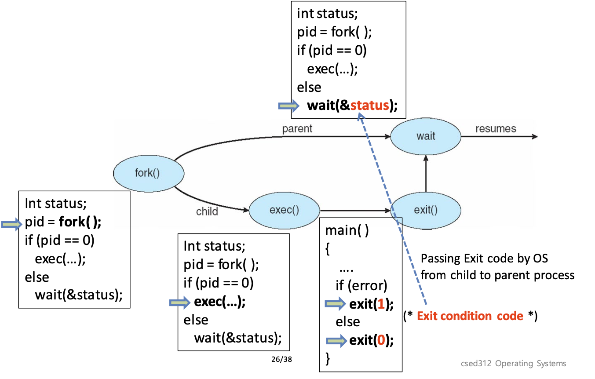
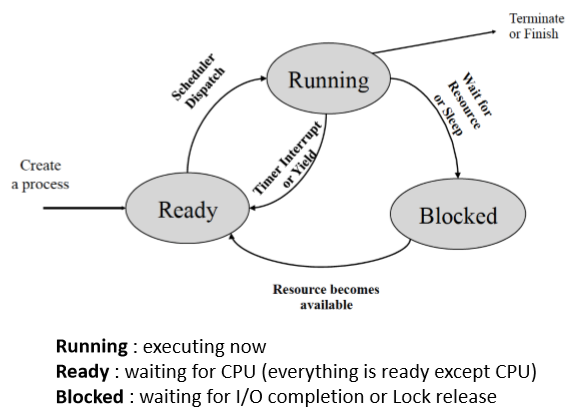
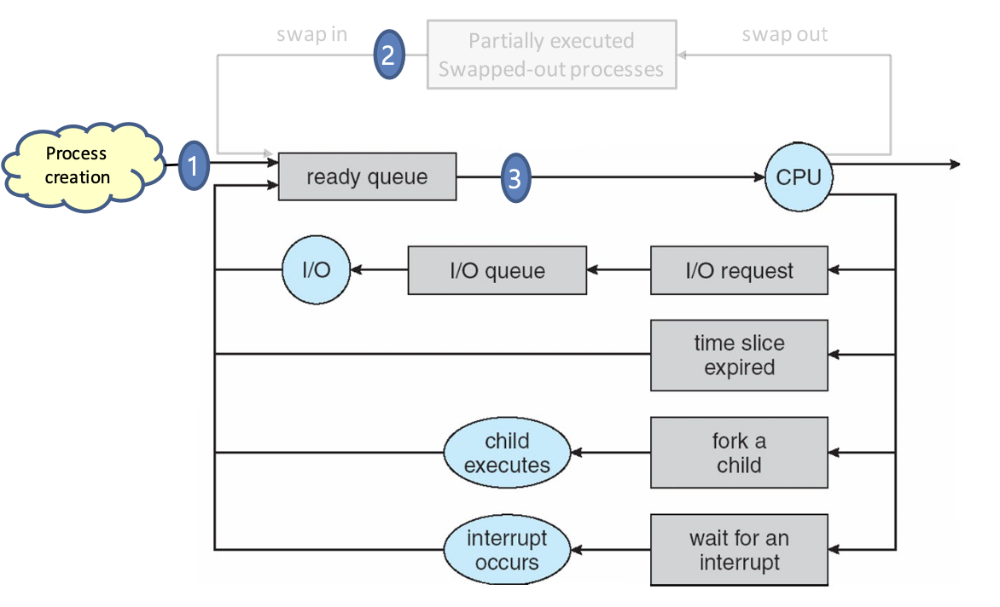

# Process Abstraction
# 어플리케이션이란
컴퓨터에서 어플리케이션이란 특정 기능을 수행하는 실행파일, executable 이 기능을 수행가능해진 상태를 지칭한다. 프로그래밍 언어로 작성된 코드가 컴파일, 어셈블, 링킹 과정을 통해 실행가능한 명령어의 집합으로 이루워진 실행파일을 생성한다. 컴파일은 고수준의 언어를 저수준의 언어로 변환하고, 어셈블을 저수준의 언어를 기계어로 변환한다. 이렇게 파일별로 생긴 목적 파일 (\*.o) 과 스태틱 라이브러리등을 링커가 엮어서 하나의 바이너리로 가공한다. 

이런 과정을 통해 생성한 바이너리를 로더가 다음과 같은 과정을 거쳐 실행을 하게 된다. 
1. 디스크에서 바이너리를 읽어온다
2. code, data, heap, stack 을 메모리 내 위치를 잡는다
3. 공유 라이브러리가 필요하다면 같이 링크한다 (메모리에 같이 shared library 의 형태로 올라간다)
4. OS 커널에게 어플리케이션의 실행을 요청한다. 

어플리케이션은 code, data, heap, stack 으로 총 4개의 섹션으로 나뉘어져있다. 메모리상에 낮은 주소로부터 순서대로 쌓여있고 (code, data, heap, stack), 힙은 밑에서부터 자라나고, 스택은 위에서부터 자라 내려온다. 이렇게 되면, 서로의 영역을 침범하지 않고 필요한 만큼의 메모리를 사용할 수 있게 된다. 이 중 스택은 컴파일러에 의해 레이아웃 된다. 그에 비해, 힙은 링커와 로더가 시작 주소만 지정을 하고, `malloc()`, `free()` 를 이용한 라이브러리 콜에 의해서 할당과 해제가 이루워진다. 
code, data 는 컴파일 시점에 레이아웃을 알 수 있으므로, 정적으로 컴파일러가 할당하고 심볼을 내보낸다. 그러면 링커가 이 심볼을 이용해 물리 주소에 재배치를 하고, 로더가 메모리에 레이아웃한다. 

### Safe execution of process
프로세스를 수행하다보면 인터럽트가 발생하는 케이스가 있다. 이럴 때는 인터럽트 핸들링을 위해서 kernel previlege 를 획득해서 인터럽트 핸들러를 수행해야한다. 모든 프로세스는 이러한 인터럽트 핸들러를 가지고 있고 메모리 상에서 os stack, heap 을 별도로 관리한다. os code, data는 프로세스별로 따로 가지고 있을 필요가 없으니, 모든 프로세스가 같은 메모리 영역을 공유한다. 하지만, 언급한대로, 프로세스 별로 커널 영역과 유저 영역을 가지고 있기 때문에, 같은 프로그램의 컨택스트로써 고려된다. 

# 프로세스
## 프로세스는 왜 필요한가?
멀티 프로세스는 CPU의 utilization 을 증가시켜준다. 두 개의 프로세스가 동시에 수행될 수 있다면, 하나의 프로세스가 유저의 입력을 기다리는 시간 동안, 다른 프로세스를 수행할 수 있어 빈 시간 없이 utilization 을 증가시킬수 있다. 또한, 레이턴시를 줄여준다. A 프로세스가 80초가 걸리고 B 프로세스가 20초 걸리면, 멀티 프로세스 스케쥴링을 통해서 B가 A가 모두 끝나는 것을 대기 하지 않아도 될 수 있다. 프로세스는 머신에 대한 자기만의 뷰를 가지고 있다. 자기만의 address space 가 있고, 연 파일을 소유하고, 가상의 CPU를 보유하고 있다. 

## 포크
포크는 왜 사용하는가? 포크는 현재 프로세스의 사본을 새 프로세스를 만든다. 부모 프로세스의 address space 를 복사해 자식 프로세스를 만들어. 이때, 현재 코드, 데이터 스택과 OS 상태를 복사해가. 하지만 최적화 측면에서 code는 같을 것이므로 공유하고, 데이터는 쓰기가 발생할때 복사해가는 방법도 있어. 부모는 자식의 pid를 받고, 자식은 0을 받게 된다. 포크를 사용하게 되면, 자식을 만들기 위해 해야하는 것들 (fd 설정, 네임스페이스 수정, 기타 등등) 없이 현재 프로세스의 사본을 만든다는 점이 장점이다. 따라서, create 하는 대신 fork + exec 로 해결할 수 있어. 

### 프로세스의 구조
모든 프로세스는 Process Control Block 이라 불리는 메타데이터를 가지고 있어. 이 PCB 는 프로세스의 상태를 관리하고 그 외 프로세스를 돌리는데 사용하는 다양한 정보들을 담고 있어. 예를 들자면, 프로세스 상태 (running, wainting,ready,etc), pid, uid, pc, 레지스터, address space, 연 파일등. OS는 이러한 PCB에 필요한 정보들을 담아서 관리를 해. 
프로세스는 실행 상태에 따라 READY, BLOCK, RUNNING, DYING 등의 상태를 가질 수 있어 (pintos 기준).

이 프로세스에서 중요한 트렌지션 등이 있는데, 
- ready -> running: 
	- short-term scheduler 에 의한 dispatch
- running -> ready: 
	- interrupt (involuntary)
	- yield (voluntary)
- runnning -> blocked:
	- I/O or event wait
- blocked -> ready 
	- I/O or event completion
위와 같은 상황에서 상태 전이가 일어나

이러한 프로세스의 상태에 따라서 스케쥴러는 적절한 다음 프로세스를 골라. 스케쥴링 전략에 대해서는 다양한 방법론이 있는데, 이는 다른 글에서 다루도록 할게. 또한, 프로세스는 수행중에 preemption 에 의해 kernel 이 컨트롤을 가져가는 경우가 있어, syscall, 타임 퀀텀을 다 사용했을 때의 타이머 인터럽트, 디바이스 인터럽트 등이 있어. 이러한 상황에서 프로세스 $P_0$ 는 $PCB_0$ 에 현재 상태를 저장하고 $PCB_1$ 에 저장된 $P_1$의 상태를 꺼내와서 프로세스를 수행해. 그리고, 인터럽트나 시스콜이 발생하면 반대로 다시 $PCB_0$ 을 참조해서 $P_0$로 돌아가. 

## 스케줄러의 종류
스케줄러에 대한 자세한 내용은 다음 글에서 다루도록 하고, 스케줄러의 종류에 대해서 알아보자. short-term scheduler 는 밀리초 단위로 ready queue 에서 어떤 프로세스를 받아올지 결정하는 스케줄러야. long-term scheduler 는 초나 분 단위로 느리게 호출되고, 생성된 프로세스를 레디큐에 넣는 순서에 대해서 결정을 해. 이러한 long-, mid-term scheduler 는 CPU-bound 와 I/O-bound 맞추기 위해 존재해. I/O-bound process 란 입출력에 시간을 더 많이 쓰는 프로세스고, CPU-bound 는 연산에 시간을 더 많이 쓰는 프로세스야. 극단적인 케이스로는 I/O-bound process 만 있다면, ready_list 가 전부 놀고 있을 테고, CPU-bound 라면 I/O queue 가 계속 비어있을 것이다. 

