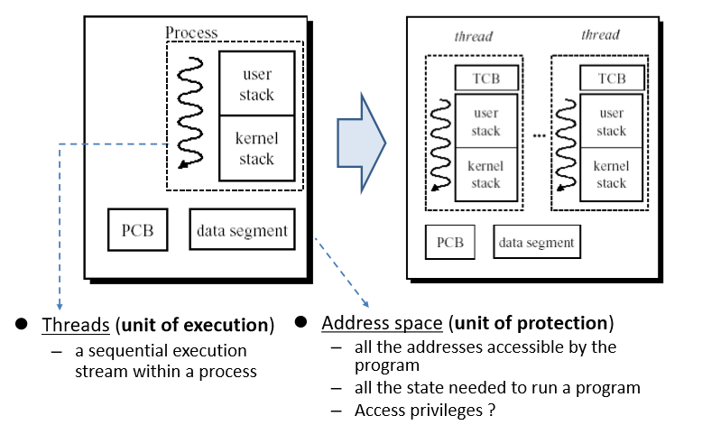

# Thread

## 스레드
단일 프로세스 안에서도 동시성을 유지할 수 있는 방법으로는 스레드가 있어. 프로세스는 PCB 등으로 표현되는 메타데이터라 여러가지 사전 준비가 필요하지만, 스레드는 그거보다 가벼운 추상화다. 한 프로세스 안에 있는 모든 스레드는 메모리와 파일 디스크립터, code, data, files 등을 공유해. 대신 스레드 별로는 레지스터, 스택을 별도로 사용해. 

근데 우리는 왜 스레드가 필요할까? 그냥 프로세스를 여러개 만들면 되지 않을까? 이번 글에서 언급했듯이 프로세스를 만드는데는 훨씬 더 많은 비용이 필요하다. 따라서, 프로그램내에서 특정 기능을 수행하는 부분만 짤라서 작은 단위로 생성하는게 훨씬 싸다. 

프로세스를 thread 와 address space 의 요소로 나눠서 stack 은 프로세스별로 따로 가지고, 레지스터, 코드, 데이터, 힙은 프로세스간에 공유를 하도록 한다. 이렇게 함으로써 생성 비용과 컨텍스트 스위칭 비용을 낮춘다. 

그러면 우리가 프로그램을 짤 때, 스레드가 스위칭 되는 것을 고려하고 짜야할까? 이렇게 되면 굉장히 복잡도가 올라가기 때문에, 스레드의 관점에서는 자기가 자기만의 CPU를 가지고 있다고 착각한 상태이야. TCB에 현재 실행 상태를 저장하고 로드하는 방식으로 진행되는데, 먼저 스레드를 인터럽트하고, TCB에 레지스터등 실행등에 필요한 정보를 저장하고 다음 스레드를 뽑아서, 그 상태를 로드해온 다음 과거에 실행중이던 위치로 점스해. 이렇게 하면, 스레드 입장에서는 순차적으로 명령어를 수행하는 거기 때문에, seemless 한 concurrency 가 가능해. 

## 스레드의 생성
스레드는 다음과 같은 단계를 거쳐 생성된다. 
1. TCB 생성 및 할당
2. 스택 할당
3. stub 에서 시작할 수 있도록 pc 조정하기
4. stack 에 stub 인자들; func, arg 집어 넣는다
5. thread_switch 를 위한 dummy stack frame 을 집어넣는다
6. thread 를 대기열에 등록한다. 

스레드는 일반 함수와 다르게 일반 함수가 끝난게 아니라, 종료작업이 추가로 필요하다. 따라서 스레드를 `func(arg)` 로 실행하는게 아니라 `stub(func, arg)` 처럼 실행해 스레드가 종료된 이후에 stub 로 돌아와 `thread_exit()` 을 자동으로 실행하게 하기 위해서다. 

## 스레드의 컨텍스트 스위칭
스레드는 다음과 같은 순서로 컨텍스트 스위칭을 한다. 이는 새로운 스레드를 만들때도 마찬가지야.  
1. save regs on old stack
2. switch to new stack, new thread (with esp)
3. restore regs from new stack
4. return
하지만, 스레드가 처음 생성될 때는, thread_switch 에 의해 기존 상태가 저장된 적이 없기 때문에, 더미 스택프레임을 만들어 마치 thread_switch 에 의해서 컨텍스트 스위칭이 되었던 적이 있는 것처럼 작동해.

이러한 컨테스트 스위칭은 자발적인 것과 비자발적인 것 두가지로 나뉘어. 자발적은 `thread_yield()`에 의해서 스레드가 자발적으로 프로세서를 놓아주는 것이고, 비자발것인건 인터럽트로 인해 프로세서를 os 에게 뺏기는 것을 말해. 이 때도 `thread_switch`와 비슷한 순서로 컨텍스트를 바꾸는데, 과거 실행 상태를 저장하고, 커널 핸들러를 실행, 그리고 다시 `thread_switch`를 불러 원래 실행장소로 되돌아가. 

## 유저 레벨 프로세스의 멀티 스레딩
지금까지 정리한 내용들은 커널 프로세스의 멀티 스레딩이다. 그렇다면 유저 레벨 프로세스에서는 어떻게 해야할까? 가장 간단한 방법은 kernel 스레드를 사용해서 구현하는 것이다. 유저 라이브러리가 유저 스택을 할당한 후 스레드 생성 시스콜을 한다. 그 후, 커널 스레드의 TCB, 커널 스택을 설정하고, thread 의 시작 지점을 유저 스택으로 지정한다. 그 이후 스레드를 대기열에 넣는 방법이 있어. 다만, 이러면 모든 스레드 동작이 시스콜을 통해 해야하기 때문에 성능이 나뻐. 
두번째 방법은 아예 라이브러리 처럼 유저레벨 스레드를 만들어버리는 것이다. 시스콜 대신 이 라이브러리에 스레드 생성을 요청하여 라이브러리를 통해 스레드를 관리하는 것이다. 다만, 이렇게 프로세스 내부에서 생성된 라이브러리 스레드들은 운영체제에서 인식 할 방법이 없어, 단일 스레드 프로세스로 인식해 인터럽트 발생시 스레드가 이동이 불가능하다. 
세번째 방법은 커널의 도움을 받는 유저 레벨 스레드다. 스케쥴러 액티베이션이라고 부르기도 하는데, 커널이 유저 레벨 라이브러리에게 프로세서를 할당해. 위에서 문제시 되는 것은 유저 레벨 스레딩의 스케쥴링과 스위칭이 안되는 점인데, scheduler activation 은 유저 스레드에 영향을 미칠만한 이벤트를 전달 받는 전용 스케쥴러를 만드는 것이다. 이 스케쥴러가 커널에게서 받은 이벤트를 기반으로 유저 레벨 스레드들의 스케쥴링을 담당하게 된다. 