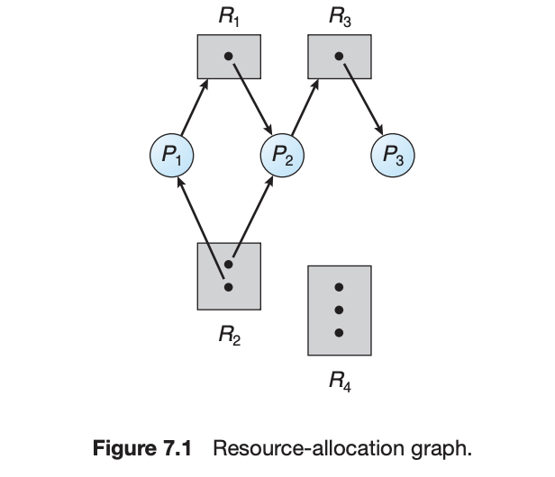

# Deadlock
멀티프로세스 환경에서 여러 프로세스들은 제한된 개수의 자원을 가지고 경쟁을 하게 된다. 따라서, 어떠한 프로세스ㅌ는 필연적으로 대기를 하게 된다. 이러한 대기 상태에서 그 프로세스가 다시 상태가 못 변하는 상황을 우리는 deadlock 이라고 부른다. 좀 더 포멀하게 정의하자면, 어떠한 셋의 프로세스가 모두 대기 상태에 있고, 그 대기 상태를 초래한 프로세스가 그 셋 안에 있을 때, 이 셋의 프로세스는 데드락 상태에 있다고 말할 수 있다. 

좀 더 디테일한 조건들은 다음과 같다. 
1. Mutual exclusion: 최소 하나의 리소스가 공유 불가능한 상태로 존재해, 해당 리소스를 요청한 프로세스가 대기를 해야한다. 
2. Hold and Wait: 프로세스는 최소 하나의 리소스를 잡고 있고, 다른 리소스를 대기하고 있는 상태이다. [[Synchronization]]
3. No Preemption: 리소스는 선점 될 수 없다 = 리소스는 잡고있는 프로세스가 놔줘야지만 되는 상황이다
4. Circular wait: set of process 안에서 순환 대기를 하고 있는 상태여야한다. 

### Deadlock 의 예시
```c
// Thread A 
Lock1.acquire();
Lock2.acquire(); 
while(need to wait)
	condition.wait(&Lock2); 
Lock2.release();
Lock1.release();


// Thread B  
Lock1.acquire(); 
Lock2.acquire(); 
condition.signal(&Lock2); 
Lock2.release(); 
Lock1.release();
```
스레드 A가 락 1, 2를 전부확보한 상황이다. 스레드 1은 잤다 일어났다 하면서, cond signal 을 기다린다. 하지만, 스레드 B가 cond signal 을 보내려면 Lock1, 2를 모두 가져야한다. 이미 락 1,2는 스레드 A가 전부 가지고 있으므로 데드락 상태라 할 수 있다. 

## Resource Allocation Graph
이러한 데드락 문제에서 프로레스와 리소스 간의 할당 및 요청의 관계를 나타낸 다이어그램이 Resource Allocation Graph 이다. 


리소스를 향한 화살표는 리소스에 대한 요청이고, 리소스 안의 점에서 나오는 리소스는 해당 프로세스가 리소스의 해당 인스턴스를 소유하고 있다는 의미다. 이러한 그래프 내에서 사이클을 통해 데드락 여부를 확인 할 수 있다. 만약 리소스 내의 인스턴스가 하나인 리소스 끼리의 사이클이 완성 된다면, 무조건 데드락이라고 할 수 있다. 하지만, 인스턴스가 두개 이상인 리소스를 기고 있는 사이클은 데드락 존재의 필수 조건은 아니다. 


## Deadlock 의 핸들링
데드락을 핸들링하는데는 많은 전략이 있다. 
- Prevent: 데드락 상황을 발생하지 않도록 프로그램의 행동을 제약, 컨트롤한다
- Avoid: 데드락 상황을 미리 예측한다
- Detect and recover: 데드락 발생시 탐지 및 수정을 한다. 

## Prevent
위에서 언급한 데드락의 조건이 발생하지 않도록 예방하는 방법이 있다. 
1. Mutual exclusion 은 최소 하나의 리소스는 공유 불가능한 상태에 있어야하는 것이다. 공유 가능한 자원의 가장 대표적인 예시는 read-only file 이다. 여러 프로세스가 동시에 접근할 수 있으므로 mutual exclusion 이란 상황 자체가 발생하지 않는다. 하지만, 어떠한 공유 자원은 그 전제 조건 자체가 non-shareable 인경우가 있어 (e.g. mutex lock) 이 조건은 예방이 불가능하다. 
2. Hold and Wait 를 예방하는 방법은 프로세스가 임의의 리소스를 요청할 때, 다른 리소스를 못 잡고 이게 하는 것이다. 첫번째 방법으론 프로세스 생성시 필요한 리소스를 모두 잡는 것이다. 또는, 리소스를 안 잡고 있을 때만, 리소스를 요청할 수 있게 해주는 것이다. 하드 디스크에 있는 데이터를 메인 디스크로 옮기고, 파일을 정렬 후 인쇄하는 작업을 한다고 생각해보자. 이랬을때, 프로세스 생성시 하드, 메인 디스크, 프린터를 한번에 잡아버리는 거다. 하지만, 프린터는 프로세스의 마지막 단계에만 필요하니 리소스 효율성이 떨어진다. 두번때 방법은 하드, 메인 디스크를 요청하고, 하드를 해제하고, 메인 + 프린터를 요청하는 거다. 하지만 두 가지 방법 모두 단점이 있다. 첫번째는 resource utilization 이 낮은 것이다. 두번째는 자주 사용되는 리소스를 이용하는 프로세스는 오랜 시간 대기를 할 수 있다. 이 프로세스가 필요로 하는 리소스중 일부는 언제나 다른 프로세스에 의해 사용중일 수 있기 때문이다. 
3. No preemption 조건은 리소스를 자발적으로 내놓지 않을 경우다. 다음과 같은 프로토콜을 생각해 볼 수 있다. 만약 프로세스가 리소스를 몇개 잡고, 새로운 리소스를 요청했을 때 해당 리소스를 바로 잡지 못한다면, 다른 리소스들을 해제한다. 이렇게 해제된 리소스는 해당 리소스를 대기하는 프로세스에 할당된다. 그 후, 양보한 리소스를 다시 잡았을 때, 다시 새 리소스 요청을 시도한다. 두번째 방법은 프로세스가 임의의 리소스를 요청했을 때, 해당 리소스가 사용가능한지 체크한다. 만약 사용 불가능하다면, 해당 리소스를 사용중인 프로세스가 다른 리소스를 대기 중인지 확인한다. 만약 사용중인 프로세스도 대기중이라면 그 프로세스가 잡아놓은 자원을 해제하고, 요청 프로세스에게 준다. 이게 불가능하다면, 대기한다. 
4. Circular wait 는 모든 자원에 순서를 부여하고, 해당 순서대로만 자원을 할당하도록 하는 것이다. 이렇게 하면, 2를 잡고 1을 대기, 1을 잡고 2를 대기하는 상황 없이 모든 프로세스가 1,2 를 순서대로 잡게 된다. 

가장 간단한 예방법은 충분히 많은 자원을 준비하는 것이다. 무한 리소스 상황에서는 데드락이 발생하지 않으므로, 무한가지는 아니더라도 프로세스가 쓸 만큼의 충분한 리소스를 준비하는 것이다. 두번째로는 락을 잡고 대기를 하지 않는 것이다. 만약 외부의 모듈로 나가는 상황이라면 락을 해제하고 나가는 것이다. 마지막으로, 락은 언제나 순서대로 잡게 만들어서 (락에 번호를 메겨 작은 순자의 락부터 잡는다), 순환 대기를 막는 방법이 있다. 

| Order | Thread 1              | Thread 2   |
| ----- | --------------------- | ---------- |
| 1     | Acquire A             |            |
| 2     |                       | Acquire B  |
| 3     | Acquire C             |            |
| 4     |                       | Wait for A |
| 5     | If (maybe) wait for B |            |

위와 같은 순서에서는 스레드1이 락A를 가지고 있어 스레드2 B를 든 상태에서 wait 하고 있기 때문에, 스레드 1이 B를 못 받는다. 따라서, 이는 순서를 스레드 2가 스레드 1이 락A를 잡기 전에 먼저 대기를 하고 있는 등으로 해결해 볼 수 있다. 또는, 항상 A, B, C 순으로 필요 리소스를 잡는다면 서순 문제로 데드락에 빠지지 않을 수도 있다. 

또 다른 방법은, pseudo-detection 이다 avoid 와 일부 유사항 방법이다. 필요한 리소스를 미리 다 잡아두는 것이다. 만약에 못 잡는 다면 (타임아웃), 롤백한다. 하지만, 연산 전에 미리 필요한 리소스를 미리 알 수 있는게 아니라면 불가능한 방법이기도 하다. 

## Avoid
prevention 은 데드락의 발생 조건을 막아서 데드락 상태에 빠지지 않게 한다. 하지만, 이 방식의 접근은 리소스 가용율을 낮춰 성능 면에서 손해를 보게 된다. 데드락 상황을 회피하는 것은 시스템에 어떤 리소스가 있고, 어떤 프로세스가 요청을 는지 알고 있어야한다. 임의의 프로세스가 요청하는 최대 리소스의 개수를 prior knowledge 로 알고 있다면, 시스템이 데드락 상태에 안 들어도록 avoidance 알고리즘을 만들 수 있다. 

### Safe State
시스템은 모든 프로세스에 대해서 각 프로세스의 최대 리소스를 할당하는 어떠한 프로세스의 sequence 가 존재하다면, *safe* 하다고 할 수 있다. 
$$
\begin{gather}
S = safe \\
\iff \exists<P_1, P_2, ..., P_n>,\\ \forall P_i\text{'s max resource can be allocated by available + resource held by} P_j (j < i)
\end{gather}
$$

따라서, 앞의 프로세스가 종료되면 시퀸스의 다음 프로세스가 리소스를 얻을 수 있다. 

### Banker's Algorithm

Banker's Algorithm 은 다음과 같은 데이터 구조를 필요로 한다. 
- Available: Vector of length m. If Avail\[j] = k, there are k instances of resource type $R_j$ available.
- Max: n x m matrix. If Max \[i,j] = k, then process $P_i$ may request at most $k$ instances of resource type $R_j$.  
- Allocation: n x m matrix. If Alloc\[i,j] = k then $P_i$ is currently allocated k instances of $R_j$.  
- Need: n x m matrix. If Need\[i,j] = k, then $P_i$ may need k more instances of $R_j$ to complete its task.
#### Safety Algorithm
1. ***Work*** and ***Finish*** 매트릭스를 ***Work*** = ***Available***, ***Finish***= \[false] $\times$ $n$ 로 초기화 한다
2. 다음을 만족하는 $i$ 를 찾는다 (완료하는데 필요한 리소스가다 적은 리소스를 가진 프로세스 중, 현재 필요하는자원의 개수가, 가용 가능한 자원보다 적으면 자원을 할당한다. 
	1. ***Finish***\[i] == false 
	2. $Need_i \leq Work$ 
3. 2번 스텝에서 필요한 자원보다 가용 자원이 많으므로 자원을 할당하고 프로세스를 끝낸다. 그 후, 프로세스를 종료로 마크한다. 
	1. $Work = Work + Allocation_i$
	2. $Finish[i] = true$
	3. Go to Step 2
4. If $\forall i, Finish[i]== true \rightarrow$ safe state

### Resource-Request Algorithm
요청을 할 때는, 실제로 요청을 하는 것처럼 확인을 한다. 
1. 만약, $Request_i \leq Need_i$, go to step 2, else error
2. 만약, $Request_i \leq Available_i$ go to step 3, else error
3. 다음 작업을 수행한 후, 시스템이 safe 한지 확인한다. 
	1. $Available = Available - Request$
	2. $Allocation_i = Allocation_i + Request_i$
	3. $Need_i = Need_i - Request_i$
4. 만약 safe 하다면, 리소스를 할당해준다. 

## Detection & Recovery
Detection 또한 위의 뱅커 알고리즘을 이용해 수행한다. safety check 가 사실상 detection 하는 것이기 때문에 같은 알고리즘을 사용하면 된다. 데드락을 탐지할 경우, process termination 이나 resource preemption 으로 리소스를 필요한 곳에 할당해 복수를 한다. 
