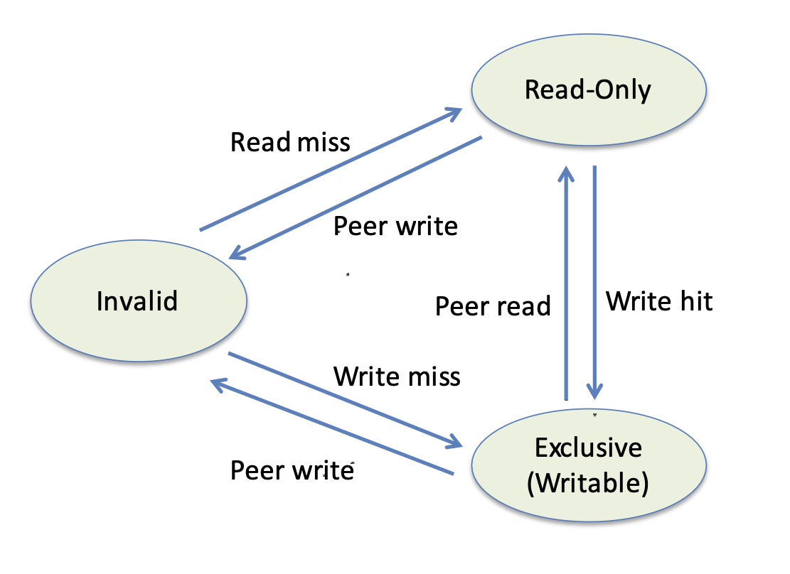
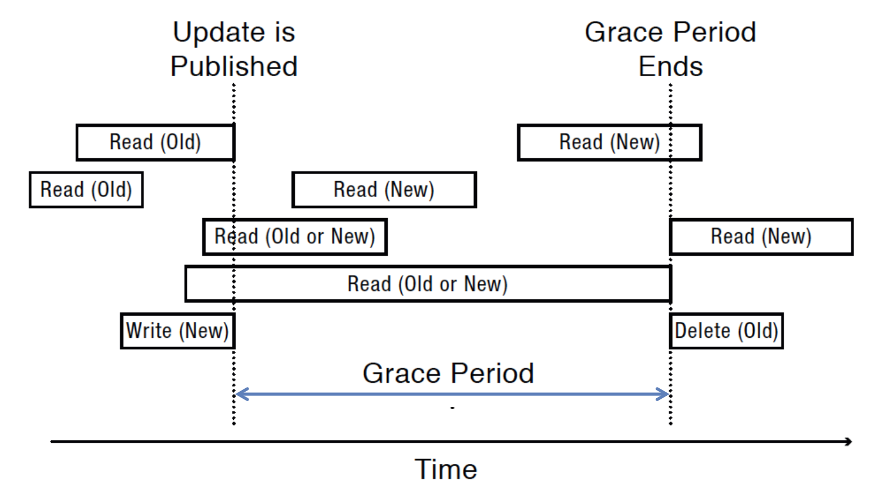

# Multi-Object Synch
여러 개의 오브젝트를 큰 스케일의 프로그램에서 동기화를 하는 건 당연하지만, 성능을 낮게 만들어. 여러개의 스레드의 생성에서의 오버헤드, 한 스레드 밖에 락을 잡을 수 없으니 다른 스레드들이 기다려야하고, 공유 데이터가 여러 프로세서 사이에서 이동을 해야할 수도 있고, 데이터를 사용하지 않는 코어들한테까지 데이터를 옮겨야하는 일도 벌어져. 이번 글에서는 이러한 문제점과 특수 케이스에 대해서 이러한 문제를 해결하는 방법에 대해 이야기 해보려고 해. 


## Multiprocessor Cache Coherence
두 개의 스레드 A,B 가 존재하는 상황이야. 이때 스레드 A 가 임계영역 안의 데이터를 수정하고 락은 해제했어. 스레드 B는 락을 잡고 데이터를 읽었어. 만약에 이 데이터가 메인 메모리에 있으면, 하드웨어 시스템 안에 이 데이터는 한 개의 사본만 존재해 문제는 없어. 하지만, 만약에 이 데이터각 각 프로세서의 캐시가 되어있어서, 프로세서 A의 캐시는 업데이트된 사본이 있고, B에는 과거의 사본이 존재하는 문제가 발생해. 


## Write-back Cache Coherence
캐시 일관성을 지켜야 시스템이 마치 한개의 사본의 데이터를 가진 것처럼 작동해. 읽기 상황에서는 여러개의 캐시가 사본을 가지고 있어도 상관 없어. 하지만, 쓰기 상황에서는 여러개의 사본이 있다면 위와 같은 상황이 벌어져. 따라서, 쓸 때는, 쓰기 전에 모든 캐시된 사본을 invalidate 하고, 수정된 사본은 해당 프로세서의 캐시에 저장하는 거야. 읽을때는 해당 데이터의 오너나 메모리로부터 읽어오는 거야. 
위와 같은 상황은 캐시된 사본의 상태가 어떻게 변화하는지에 따라 그린 상태 다이어어그램이다. 
현재 사본이 invalid 상태일때, read miss 일경우 메모리에서 최신 사본을 read-only 상태로 떠오고, write miss 일 경우 writable 상태로 떠온다. Read-only 상태의 캐시일 경우, peer 캐시에 쓰기가 발생하면 더이상 최신 사본이 아니므로 invalidate, write hit 일경우 쓰기 위해 writable 로 간다. 만약 writable 일 경우, peer 가 쓰여진다면, 마찬가지로 최신 사본이 아니므로 invalidate, peer 가 읽히면, read-only 상태로 간다. 

이러한 캐시 일관성 이슈 때문에, `read-modify-write` 가 atomic 한 인스트럭션으로 존재해, writable 캐시에 대해 수정을 가하는 동안, 다른 캐시가 과거의 사본을 캐시하지 못하도록 한다. 


## Lock Contention
락은 프로세스를 느리게 만드는 주 원인이다. 하나의 공유 데이터에 여러 프로세스들이 붙을 수록 점점 더 속도는 느려진다. 

```c
Counter::Increment() {
	while (test_and_set(&lock))
		;
	value++;
	lock = FREE;
	memory_barrier();
}
```
위 코드를 이용해 아래 케이스 중 어떤게 빨리 끝날지 보면, 
1. 스레드 한개가 하나의 배열을 루프할때
2. 스레드 두개가 두개의 배열을 루프할때
3. 스레드 두개가 하나의 배열을 루프할때
4. 스레드 두개가 하나의 배열을 짝수와 홀수로 나눠 루프할때
이런 상황에서 1, 2, 4, 3 순서로 빨리 끝난다. 

이렇게 lock contention 을 줄이는 방법중 공유 데이터를 파티션으로 나눠 읽는 방법이 있다. 오브젝트를 파티션으로 나눠 각각의 파티션을 락으로 지키며 하는 방법, 프로세서 별로 데이터를 만들어서, 하나의 프로세스가 하나의 데이터에 접근할 수 있도록하는 방법으로 per-processor heap 등을 구현하는 경우가 있다. 마지막으로, 하나의 스레드만이 공유 자원에 접근할수 있도록 pipeline of thread 를 만드는 방법도 있다. 

만약에 락이 여전히 프로세스의 보틀넥이라면 
- MCS Lock: 락의 구현은 contention 에 최적화 하는 방법
- RCU (read-copy-update): reader 는 락 없이 읽는 방법
등의 방법으로 해결을 해볼 수 있다. 

## test and test-and-set
### test-and-set 의 문제점
test-and-set은 여러가지 문제점을 가지고 있다. lock 에 값을 쓰는 것때문에, 많은 cache coherency traffic 을 발생시키고, FIFO ordering 을 보장하지 않는다. 

여러 프로세서에서 계속적으로 lock 에 1을 쓰게 된다, 그러면 이러한 쓰기가 발생할때마다 계속 각 프로세서의 캐시를 invalidate 해줘야한다. 이러한 문제를 해결하기 위해서 나온 것이 test and test-and-set 이다. 
### test and test-and-set
```c
procedure EnterCritical() {
  do {
    while ( locked == true )
         skip // spin using normal instructions until the lock is free
  } while ( _TestAndSet_(locked) == true ) // attempt actual atomic locking 
										   // using the test-and set
}

 procedure EnterCritical() {
   while ( locked == true or TestAndSet(locked) == true )
     skip // spin until locked_
 }
```
두가지 구현이 있는데 사실 같은 것이다. test-and-set 은 set을 하기 때문에 다른 프로세서의 캐시를 무표화해야한다. 따라서, lock 의 값을 읽기만 해서 (test), test-and-set 까지 할지 말지 결정을 한다. 만약에 `lock`이 참이라면 계속 대기를 하고 있는다. 그 후, `lock` 이 busy 하지 않을 때 가서, 해당 락을 `test-and-set` 으로 확보한다. 이렇게 하면, 프로세서 1의  스레드가 락을 들고있는 동안은 값에 대한 쓰기가 발생하지 않으므로, P2, P3의 test 는 local cache 를 통해 test 할 수 있다. 이러한 방식은 지속적인 쓰기가 발생하지 않아 캐시 일관성을 맞추기 위한 트랙픽이 덜 발생하게 된다. 하지만, 여전히 공유 변수인 lock 에 대한 읽기가 발생하고, 이 값이 쓰여졌을때는 여전히 다른 프로세스 내 캐시를 무효화 해야하는 오버헤드가 존재한다. 

## MCS Lock
MCS 락은 락을 기다리는 스레드를 리스트로써 관리한다. TCB 에 `next` 로 다음 스레드를 들고 있고, `next->needToWait = FALSE` 를 통해 락을 전달한다. 만약 `TCB.needToWait`가 TRUE 라면 계속 스핀을 하고 있는다. 

```c
MCSLock::acquire() {
	Queue *oldTail = tail;// MCS tail
	myTCB->next = NULL;
	myTCB->needToWait = TRUE;
	while (!compareAndSwap(&tail,oldTail, &myTCB)) {
		// try again if someone changed tail
		oldTail = tail;
	}
	if (oldTail != NULL) {
		// Need to wait
		oldTail->next = myTCB;
		memory_barrier();
		while (myTCB->needToWait)
		; // Spin
	}
}

MCSLock::release() {
	// make sure there wasn’t a race
	if (compareAndSwap(&tail,myTCB, NULL)) {
		// if tail == myTCB, no one is waiting, MCSLock is now free
	} else {
		// someone has executed C&S but not set myTCB->next field
		while (myTCB->next == NULL) // spin until next is set
		; 

		myTCB->next->needToWait = FALSE;		// tell next thread to proceed
	}
}
```
내가 락을 확보할때는, 일단 첫번째로 현재의 tail 이 내가 line 2를 실행할 때의 받은 tail 과 같은지 다른지 체크를 한다. 이는 `compareAndSwap` 인스트럭션을 사용한다. 현재의 tail 이 expected oldTail 과 다르다면, 다른 스레드가 이것을 바꾼 것이므로, 다시 `oldTail`를 셋하고, 최신 tail 을 얻을 때까지 반복한다. 현재 `tail`을 획득한다면, 이제 스핀락 대기를 해야한다. `needToWait`이 false 가 될때까지 (앞의 스레드가 release해 내 TCB의 `needToWait` 가 false 로 바뀐다), 스핀한다. 
락을 놓을때는, 현재 락이 마지막 락인지 체크가 마지막이라면 바로 leave 한다. 만약의 다음 스레드가 대기중이라면, 다음 스레드의 `needToWait`를 바로 false 로 만들어주면 안되고, 하나를 더 체크해야한다. `compareAndSwap`이 실패했다는건, 누군가 큐에 들어오고 있는 거기 때문에, 다른 스레드에서 C&S 했지만, 아직 `myTCB->next`을 초기화 안한 경우다. 따라서 while 문으로 초기화를 대기한다. 

### MCS Lock 의 장점
언듯 보면 MCS 락이 큰 장점이 없어보이기도 한다. 일반 스핀락에 비교해서 어떤 장점이 있는 걸까? 일반 TAS 가 성능상 문제가 되는 지점은, 하나의 공통 변수에 접근을 하게 된다. TAS 의 경우 lock 이 된다. lock 이 하나의 프로세서에 캐시 되어 있어, 이 값이 업데이트 된다면, 다른 프로세서에서 가지고 있는 lock은 모두 invalidate 해야한다. 이런 cache 동기화에 있어서 성능 저하가 많이 발생한다. 그에 반해, MCS Lock 은 각 TCB에 자기만의 `needToWait` 값을 가지고 spin 한다. 따라서, 다른 프로세서에서 `needToWait` 를 false 로 세팅해줄테니 캐시 동기화에서 큰 오버헤드가 발생하지 않는다. 


## RCU (read-copy-update)
RCU는 공유데이터에 대한 읽기가 intensive 하게 벌어질때 쓰는 방법이다. 읽기를 수행할 때, 락 확보 없이 바로 들어가서 읽는다. 데이터에 대한 쓰기가 발생하면, 새로운 버전의 카피를 만들어 놓고, atomic instruction 으로 새 버전으로 한번에 배포한다. 따라서 시스템 내에는 여러 버전의 파일이 존재 할 수 있다. 또한, 스레드 스케쥴러와 함께 작업을 해야하는데, 모든 읽기 스레드가 grace period 안에 끝나는 것을 보장해야하고, 이 기간 이후에 outdated 된 버전들을 폐기한다. 
임계 영역을 읽는 중에 뺏기면 안되므로, reader 는 인터럽트를 쓰고 진입을 한다. 쓰기 스레드는 같은 카피에 두 개의 스레드가 쓰는 것을 막기 위해 락을 확보하고 새 사본을 만든다. 그 후, atomic inst 로 새 버전을 배포하고 락을 해제한다. 그 후, 일정 시간이 지난 이후 (과거 사본을 읽고있는 프로세스가 모두 끝나면), 과거 버전을 폐기한다. 

## Non-blocking Synchronization
락 확보 없이 데이터를 읽고 쓰는 방법이다. `comapareAndSwap`을 사용하는 방법인데, 데이터의 사본을 만들고, 해당 사본을 수정하고, 아무도 데이터를 사용하지 않을때, swap 한다. 만약에 포인터가 변경되어있다면, 다시 시작한다. 
