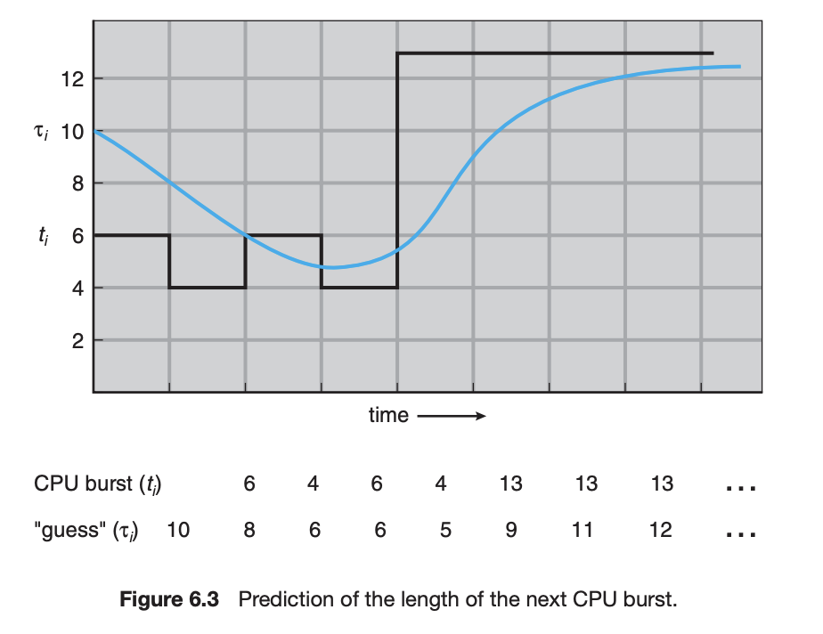

# Scheduler
CPU는 멀티 프로세스 환경에서 여러개의 작업에 대해 어떤걸 먼저 해야할지 스케줄을 해야한다. 이런 상황에서, 스케줄러는 다음과 같은 목적을 가진다
- 응답시간의 최소화
- 처리율 (throughput) 의 최대화: # of tasks/jobs completed per second
- 공정성: 유저 간 CPU를 공정하게 사용하는 것


## 용어 정리
- waiting time: 프로세스가 레디큐에서 대기한 총 시간
- response time: 첫번째 프로세스에 대한 요청 이후, 첫번째로 응답을 시작한 시간 간의 차이
- throughput: 단위 시간당 종료된 프로세스의 개수
- turnaround: 프로세스의 제출로부터 종료까지의 시간

## Preemptive & non-Preemptive Scheduling

스케줄링을 할 때는 프로세스의 선점에 대한 부분을 고려해야한다. 현재 프로세스가 CPU를 잡고 있을 때, 새 프로세스가 와서 CPU를 뺐을 수 있을지, 없을지에 따라서, preemptive, non-preemptive scheduling 이 갈린다. 
Preemptive 스케줄링 하에서는 새로운 프로세스가 더 중요하다고 프로세스가 판단하면, 현재 프로세스를 멈추고 새 프로세스에게 프로세서를 넘겨준다. 이러한 preemptive scheduling 은 다음과 같은 장단점을 가진다. 
```diff
+ Responsiveness: 높은 쓰루풋을 위해서 스케쥴링을 해 유저 요청에 대해 짧은 대기시간을 가지낟
+ Fariness: 단일 프로세스가 CPU를 장기간 점유하는 일을 막을 수 있다. 
- Overhead: 컨텍스트 스위칭을 할 때, 기존 프로세스의 상태를 복원 또는 저장하는데 오버헤드가 발생
- Race Condition: 공유 자원에 접근할 때, 다른 프로세스가 현재 프로세스를 뺏을 가능성이 존재
```
그에 비해 non-preemptive scheduling 은 공유자원 접근의 복잡성이나 컨텍스트 스위칭 등의 오버헤드는 없지만, 낮은 스루풋을 가진다. 

## Scheduling Strategy
### FIFO Scheduling

가장 간단한 스케줄링은 FIFO다. 먼저 CPU를 점유하는 프로세스가 끝나는 대로 다음에 도착한 프로세스가 사용하는 것이다. 이런식으로 스케줄링을 하게 되면, non preemptive 스케줄링만이 가능하다. 
```diff
+ 간단하다
- 짧은 작업은 긴 작업 뒤에서 오랜 시간 기다려야한다. 
```

### Shortest-Job-First (SJF)
SJF 는 시스템에 더 짧은 잡이 온다면, 그 잡을 먼저 처리하는 것이다. FIFO 스케줄링의 문제는 긴 잡이 먼저 cpu를 잡으면 짧은 잡은 금방하면 끝나는데, CPU를 못 쓰는 것이 문제다. 따라서, 짧은 잡 순서대로 CPU에 프로세스를 할당해준다. 장단점은 다음과 같다. 
```diff
+ 응답 시간을 최소화 해준다
- 불공정하다, 짧은 잡이 많으면 긴 잡은 영원히 프로세서를 못 잡을 수도 있다
- 구현의 어려움, 잡이 얼마나 걸릴지 어떻게 예측하는가?
```
SJF 는 preemptive 와 non-preemptive 구현이 둘다 있다. preemptive 구현은 만약에 프로세스가 실행중일때 더 짧은 잡이 온다면, 그 잡이 프로세서를 뺏는다.

SJF 스케줄링을 하려면, 프로세스가 얼마나 걸릴지 예상을 해야한다. 이전 CPU 버스트를 기준으로 exponential average 취하는 방법이 있다. 

$$
\tau_{n+1} = \alpha t_n + (1-\alpha) \tau_n
$$
이때 $\alpha$ 는 과거 데이터의 대한 가중치 이고, $\tau_n$ 은 예상 burst time 이다. 이렇게 처음 $\tau_0$ 을 10으로 예상하고 시작하면, 실제 burst time 과 가중 평균을 내 다음번 guess 를 맞춘다. 위 예시는 $\alpha=1/2$ 인 케이스다. 

### Round Robin
라운드 로빈은 각 프로세스가 time quantum 만큼의 cpu 시간만을 받아서 cpu를 사용하고, time slice 이후에 다음 프로세스에서 프로세서를 넘겨주는 방식이다. 만약에 프로세스 n개가 레디큐에 있고, time quantum 이 q 라면, 각 프로세스는 한번에 q 만큼 cpu를 받는다. 따라서 가장 늦게 들어오는 프로세스도 (n-1)q 시간 이상 기다리지는 않는다. 

라운드로빈의 성능은 q 값에 크게 의존한다. 만약에 q 가 크다면, FIFO 같은 형태가 되어 response time 이 길어질 것이고, q 가 너무 작으면 컨텍스트 스위칭이 너무 빈번해져 문제가 된다. 일반적인 운영체제에서는 이 q 값은 10~100 밀리초 정도이다. 
```diff
+ 짧은 작업들에게 좋다
- 작업들이 비슷한 길이라면 나쁘다, 어처피 비슷한 실행시간을 가지기 때문에, 컨텍스트 스위칭으로 인한 오베헤드가 있다. 
- waiting time 이 긴 편이다
```


### RR vs FIFO
그렇다면, 라운드로빈이 항상 FIFO 보다 좋을까? 그건 또 아니다. 만약에 비슷한 길이의 잡이 여러개 있는 상황을 생각해보자. 10개의 잡이 있고 각 100초 걸릴때 time slice 는 1초야. 그러면 모든 잡의 1초때의 작업을 하고 다시 잡 1로 돌아가. 그러면, job1 은 991 초에 끝나고, job10: 1000초에 끝나. 하지만, 만약에 FIFO를 썼다면, job1은 100s 걸렸겠지. 이렇듯 비슷한 길의의 작업이 많으면, turnaround 에서 손해를 봐. 


### MFQ

멀티레벨 피드백 큐는, 과거로 부터 학습해 미래를 예측하는 스케쥴링 전략이다. 이때의 목표는 짧은 잡을 먼저 수행하고, 오래 걸리는 잡은 우선순위를 낮춰 우선 순위를 높이는 식의 접근을 취한다. 

MLFQ는 Q1~Q64 의 여러 큐를 보유하고 있다. 각 큐는 라운드 로빈 스케쥴링을 따른다. 또한, 우선도가 높은 큐 일수록 time slice가 짧다. 프로세스 A와B가 있고, 그 중에 우선도가 높은 걸 먼저 수행하지만, 만약의 우선순위가 같다면 (같은 큐에 들어가 있다면) 라운드 로빈으로 수행한다. 

- Rule 1: 프로세스 A, B 중 우선도가 A가 높다면 A를 먼저 수행한다. 
- Rule 2: 프로세스 A, B 의 우선도가 같다면, 라운드 로빈으로 수행한다. 
- Rule 3: 잡이 시스템에 진입할때는 가장 높은 우선도를 부여받는다. 
- Rule 4:
	- 만약에 잡이 모든 타임슬라이스를 사용하면 아래 큐로 이동한다
	- 만약에 잡이 타임슬라이스가 끝나기전에 CPU를 포기하면, 같은 우선도에 머무른다. 
- Rule 6: 임의의 시간 S가 지난 후에, 모든 잡을 가장 높은 큐로 이동한다. 
MLFQ를 튜닝하는 방법중에는 높은 순위의 큐에 대해서는 짧은 타임슬라이스를 가져가고, 낮은 순위의 큐는 길게 가져가는 경우가 있다. 

하지만, 이 외로도 FreeBSD 스케쥴러는 MLFQ를 큐 없이도 사용한다. 해당 프로세스가 얼마나 cpu를 사용했는지, 시간이 지남에 따라 우선도를 부스팅 하거나, 유저에게 nice 등의 값으로 얼마나 cpu 를 잘 양보하는지를 인자로 받을 수 있다.


## Uniprocessor Scheduling
기본적으로 FIFO 가 간단하고, 오버헤드를 최소화한다. 하지만, 잡의 시간이 제각각이라면 response time 에서 나쁘다. 만약에 시간이 비슷하다면, 평균 response time 면에서 옵티멀하다. SJF는 짧은 잡을 먼저 처리하기 때문에, 평균 response time 이 빠르다. 하지만, 그 분산이 매우 큰 편이다. 태스크의 크기가 다양하다면, RR 이 SJF를 근사한다. 하지만, 크기가 비슷하다면, RR의 response time 은 느린 편이다. RR 과 Max-Min fairness 는 starvation 을 예방한다. 

## Multiprocessor Scheduling 
멀티프로세서에서는 스케줄링에 관련된 데이터들에 대해서 접근을 할 때는, 스핀락을 걸어야한다. 따라서 이 레디큐 등에 접근할때 락 컨텐션이 발생할 수 있다. 또한, 한 프로세서에서 레디큐를 업데이트 하면 다른 프로세서의 캐시에서 업데이트를 해줘야하기 때문에 성능 저하가 발생한다. 따라서 이러한 문제를 해결하기 위해 ***per-processor affinity scheduling*** 등을 할 수 있다. 각 프로세서는 자기만의 레디큐를 가지고 각자의 스핀락으로 데이터를 지킨다. 기본적으로 캐시의 invalidation, repopulation 은 자주 발생하는 비싼 비용이기 때문에, 프로세서는 가능하면 자기가 실행한 스레드는 자기가 들고 있으려고 한다. 이러한 목적을 가지고, 가장 마지막에 스레드를 돌린 레디 리스트에 다시 스레드를 넣는다. 이를 ***processor affinity***라고 부른다. 

## Scheduling Parallel Programs
MapReduce 같은 예시를 생각해보자. 각 프로세서에서 로컬 데이터에 대한 연산을 하고, {Barrier} 각 데이터를 다른 프로세서에게 보내고 {Barrier} 이걸 반복하는 시나리오다. 만약의 한 프로세서의 연산이 늦어지면, 다른 프로세서는 이미 연산을 끝내고 대기하는 경우가 생긴다.
Gang Scheduling 은 동일 프로세스에서 나온 스레드는 동일 프로세서 내에서 처리하는 방법이다. 이렇게 하면 캐시 최적화면에서 성능적인 이점을 가져갈 수 있다. 이와 유사하게, space sharing 으로 하나의 프로세스에서 나온 스레드들을 고정된 set of cpu 에서 처리하는 방법이 있다. 

## Virtualization and Scheduling
가상화 레이어 위에서의 스케줄링은 각 게스트 OS 가 수행한다. VMM 이 여러 게스트 OS를 PCPU 에서 수행하고, 각 게스트 OS가 VCPU 위에서 스케줄링을 한다. 따라서 일반 OS 보다 response time 면에서 느릴수 있다. 